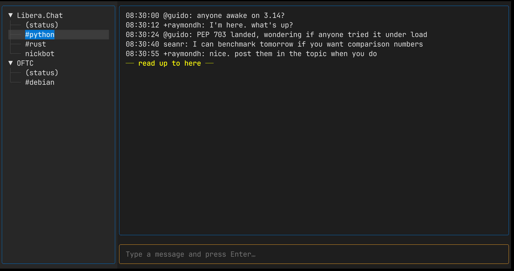

# quasseltui

Terminal client for [Quassel IRC](https://www.quassel-irc.org/) cores. Connects
to your existing `quasselcore` and gives you a Textual-based TUI as an
alternative to `quasselclient` (the Qt GUI) or Quasseldroid.



## Quick start

Run via UVX without downloading/installing:

```sh
uvx --from git+https://github.com/linsomniac/quasseltui@main quasseltui
```

Run via UV:

```sh
#  clone this repo, then:
uv sync
uv run python -m quasseltui --help
```

## Config file

Instead of using command-line arguments (`quasseltui --help` for more information), you can use a config file.

Connection settings can be loaded from `~/.config/quasseltui/config.ini`
(or `$XDG_CONFIG_HOME/quasseltui/config.ini`) so that `--host`, `--port`,
`--user`, etc. don't have to be repeated on every invocation.

Example:

```ini
[quasseltui]
default_server = home

[server:home]
host = irc.example.com
port = 4242
user = linsomniac
password = hunter2
# tls = true              (default; set to false for plain TCP)
# insecure = false        (skip cert verification; self-signed cores)
# cafile = /path/to/ca.pem
# connect_timeout = 10

[server:work]
host = irc.work.example
port = 4242
user = linsomniac
```

Because the file stores the password, make sure it's readable only by
you:

```sh
chmod 600 ~/.config/quasseltui/config.ini
```

With a config in place, three shortcuts become available:

- `quasseltui` — connects to `default_server`.
- `quasseltui <NAME>` — connects to `[server:<NAME>]`.
- `quasseltui ui --server <NAME>` — same as above, explicit form, and
  also works with `login-only` / `stream-only` / `dump-state` / `probe-only`.

Any command-line flag still overrides the corresponding config value.

## Development

```sh
uv run pytest          # unit tests
uv run ruff check      # lint
uv run ruff format     # format
uv run mypy src        # type-check
uv run lint-imports    # enforce layer boundaries
```
